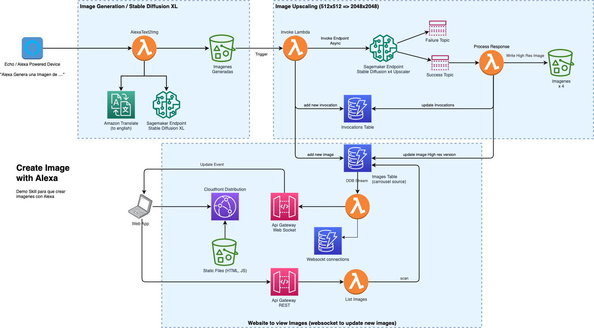

# Amazon Sagemaker - Stable Diffusion XL - Demo

TODO: more verbose explanation and proof read

## Diagram and description



### 1. Image Generation part
1. The idea is to have (or develop) an Alexa Skill capable of getting the prompt from the user. 
2. The prompt is translated to english (english prompts tends to generate better images)
3. Then, a Stable Diffusion XL endpoint is invoked, the corresponding image is stored in an s3 bucket 

Note: Despite the 3 different s3 bucket icons, it its the same one.

### 2. Upscaling Part
1. A lambda function is triggered upon object creation. It handles the images list in a dynamodb table, it also notify the website and invoke a second sagemaker endpoint.
2. This is another Stable Diffusion Model (the x4 upscaler) that is capable of taking a pic and upscale four times in both dimensions (effective x16 image size). This is an asycronous invocation because it can take like 180 secons converting a 512x512 to a 2048x2048 image.
3. After completion we update our image list with the High resolution version.


### 3. The Website
1. The website is hosted in an s3 bucket and is delivered by cloudfront. As mentioned previously, this contains the web app assets (react/js/css) alongside with all the generated images, the app code change images every 15 seconds and provide a QR code to direct access and download.

2. A Rest API  is provided to list images on page load and when we receive a websocket update.

3. Websocket API is to have a way to show  the generated imaged in realtime, as a popup in the screen for 45 seconds.


## Deployment Instructions

### Pre requisites

* Python and [CDK installed](https://docs.aws.amazon.com/cdk/v2/guide/getting_started.html#getting_started_install. And remember to [bootstrap](https://docs.aws.amazon.com/cdk/v2/guide/getting_started.html#getting_started_bootstrap) your account and region if this is your first cdk deployment.
* The first model (Stable Diffusion XL) is a [Stability AI Marketplace offering](https://aws.amazon.com/marketplace/pp/prodview-3j5jzj4k6slxs) that you need to subscribe. It's free of charge as model package. 
* Enough [Sagemaker endpoint quotas](https://us-east-1.console.aws.amazon.com/servicequotas/home/services/sagemaker/quotas) for ml.g5.xlarge or bigger. You'll need at least 2 instances.
* A copy of tweaked Stable Difussion x4 upscaler, this is the same from [Sagemaker Jumpstart](https://github.com/aws/amazon-sagemaker-examples/blob/main/introduction_to_amazon_algorithms/jumpstart_upscaling/Amazon_JumpStart_Upscaling.ipynb) but with [xformers](https://github.com/facebookresearch/xformers) in the inference code to work with less RAM. You'll see this model in `config.py`. ACL is Read for Any with an aws account.
* For the web build you'll need [yarn](https://classic.yarnpkg.com/lang/en/docs/install/) installed


### Deployment instructions

#### Preparation

1. Clone this repo. Remember that CDK needs to be installed and AWS Credentials needs to be present (vía environment variables or aws profile). 

    ```bash 
    git clone https://github.com/ensamblador/sagemaker-stable-difussionXL-demo.git
    cd sagemaker-stable-difussionXL-demo
    ```
2. Create a virtual environment and activate it. Then, install the required python packages.

    ```bash 
    python3 -m venv .venv
    ```
    ```bash 
    source .venv/bin/activate
    ```
    ```bash
    pip install -r requirements.txt
    ```

3. Edit the `config.py` with the stable difussion model package name from your susbscription. Optionally change to a instance_type that you have (ml.g5 family). 

    ```python

    # generative model SD
    stable_difussion_xl = dict (
        model_package_name = "from your subscription",
        instance_type= "ml.g5.xlarge",
        ...
    )

    # upsacaler 
    upscaler =  dict (
        image_uri = '763104351884.dkr.ecr.us-east-1.amazonaws.com/huggingface-pytorch-inference:1.10.2-transformers4.17.0-gpu-py38-cu113-ubuntu20.04',
        model_uri = 's3://844626608976-sagemaker-us-east-1/infer-prepack-model-upscaling-stabilityai-stable-diffusion-x4-upscaler-fp16-vgarriden.tar.gz',
        instance_type= 'ml.g5.xlarge',
        ...
    )
    ```
    Optional: if you want to change Stack Name or Tags, go to `app.py` in the same folder.

4. Build de react web app inside `sd-display-app` folder

    ```bash
    cd sd-display-app
    yarn install
    yarn build
    ```

    This will create a `build` folder inside sd-display-app

4. Deploy all the things!

    Take a look at the code in `stable_difussion/stable_difussion_stack.py`. In a nutshell, this cdk code accounts for all the lambdas, buckets, dynamodb, apis, and sagemaker endpoints. You can view the generated cloudformation template with `cdk synth`. 

    OK, go back to the main folder and deploy the stack:

    ```bash
    cd ..
    cdk deploy
    ```
    confirm the deployment:

    ```
    Do you wish to deploy these changes (y/n)?y
    ```

    After like 9-10 minutes all the backend is deployed. You'll see some outputs at the end

    ```bash
    SDXL: deploying... [1/1]
    SDXL: creating CloudFormation changeset...

    ✅  SDXL

    ✨  Deployment time: 536.71s

    Outputs:
    SDXL.APIimagesEndpoint = https://xxxxxxx.execute-api.us-east-1.amazonaws.com/prod/
    SDXL.WSwebsocket = wss://yyyyyyy.execute-api.us-east-1.amazonaws.com/dev
    SDXL.wwwWebsite = zzzzz.cloudfront.net
    ```
4. Update Web app with the fresh APIs and re-deploy that.

    Well, grab the two API url from the output (here in the cli or you can go to the cloudformation stack outputs) and use that in `sd-display-app/src/apis.js` :

    ```js
    const APIS = {
        images: "https://xxxxxxx.execute-api.us-east-1.amazonaws.com/prod/",
        socket: "wss://yyyyyyy.execute-api.us-east-1.amazonaws.com/dev"
    }

    export default APIS
    ```

    Save that and, again in `sd-display-app` folder, run 

    ```bash
    yarn build
    ````

    go back to the cdk folder an re-deploy the website (it will only deploy the changes)

    ```bash
    cd ..
    cdk deploy
    ```

    After this second deployment check If you can browse to `zzzzz.cloudfront.net` without errors and you're good to go! otherwise review the previous steps


5. The Alexa Skill part.

    TODO


6. Delete everything

    ```bash
    cdk destroy
    ```


Thanks to: 
- [Felipe Chirinos](chirinf@amazon.com) 
- [Maximiliano Kretowicz](maxkp@amazon.com) 
- [Enrique Rodriguez](garriden@amazon.com) 

Enjoy!
